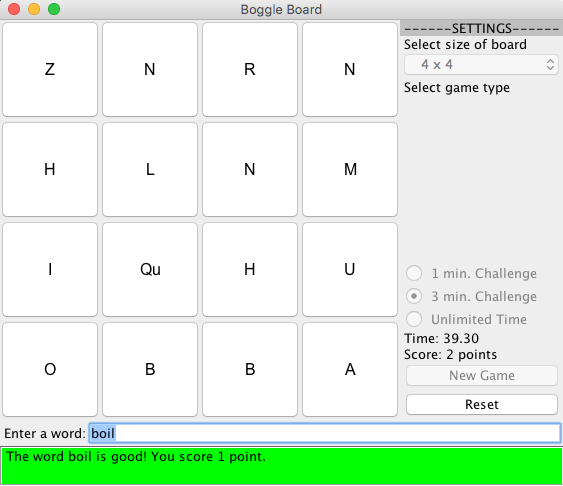
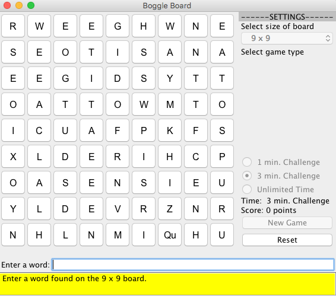

# boggleBoard
Created a GUI for the game Boggle Board.

## About

 Simple GUI for the game Boggle Board. Users have to find word generated in the grid that are composed of adjacent letters. The longer the word the more points the word is worth. There is three different modes the user can choose from: 1 min challenge, 3 min challenge or unlimited time. The game has a hidden feature. If the user types cheatcode, the program will display all the possible word combinations to the user.

 

 

 

